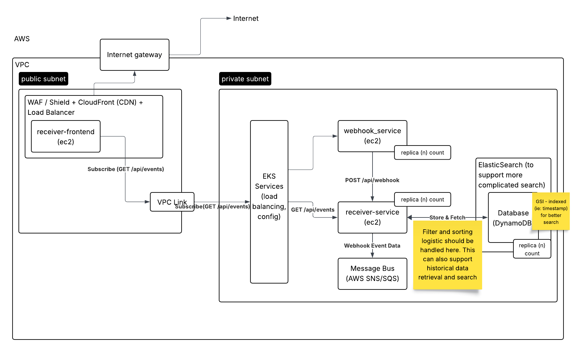

# System Durability Feedback

## Current Architecture (current webhook-events-diagram.png)

- SQS Message Queue (Message Bus) decouples webhook service from receiver where messages can persist during outages.
- Multiple availability, auto-scaling and health check - With EKS cluster, pod autoscaler, and ALB to auto remove
  unhealthy instances, we can ensure availability.
- CloudFront provides 99.99% availability with global failover.
- Kubernetes replica to ensure multiple receiver service instances.
- VPC Link & ALB to provide redundant paths for API traffic.
- We move filter and sorting logic to the receiver-service instead of having it in the frontend. This way, we can
  consolidate business logic and speed up the frontend, as well as adding more complicated logic (search) in the future.

## Possible architecture changes for improvements

- For the database, we can create multiple read replica and cross-region replica to distribute load and
  to help with disaster recovery.
- We can also add replication for SQS Message Queue and archive to S3 to avoid losing data during failures and to
  prepare for disaster recovery.
- For communication between Webhook Service -> SQS -> Receiver Service, we can implement circuit breaker pattern where
  we can store locally with retry scheduler, with proper failure threshold and timeout.
- We should also add backup strategy, such as for Database, we can have daily snapshots (7 day retention),
  point-in-time recovery, or cross-region snapshot.
- For deployment & configuration, we should store our kubernetes manifest, or has infrastructure as
  code (terraform, CDK), along with the project / or in version control.
- We should also include other monitoring services such as metrics, alerting (Cloudwatch), distributed tracing (with
  correlation IDs), and log aggregation.
- For data consistency & replay, we should enhance message processing such as filtering out event that is already
  processed, idempotency check to prevent duplication.
- We can create a separate Replay API and extract out historical data processing logic to this api.
- We can also create audit trail for all data modifications.
- With SQS storing our messages and the autoscaling, we should be okay even if receiver message is down. However, if we
  have database failure when there is a total system failure, or region wide failure, we might lose data, therefore, we
  might want to add replica to the database, as mentioned in the first item.

With these enhancements, we should have 99.99% availability with fast recovery time for most failure scenarios.

### Additional improvements for each project components:

- Infrastructure as code - Terraform or CDK
- Runbook & Documents
- Load tests
- Unit tests (ie: Jest)
- Integration tests
- UI tests (ie: Storybook, frontend only)
- Add logging, metrics, altering, tracing, synthetic monitoring
- Cache layer
- Security - Add api key (or auth), add csp (content security policy), and other secure headers
- Integrate security scan and check (especially for frontend code) to see if we expose any security risks, during CI/CD,
  and after deployment
